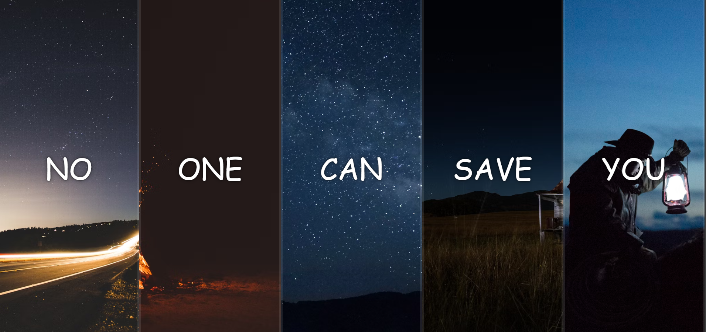

# 🖼️ Simple Gallery with Motivational Words

A clean and minimal **Image Gallery** built with **HTML, CSS, and JavaScript**, featuring motivational quotes. The design is simple, and perfect for personal projects or portfolios.

## ✨ Features
 
✅ **Motivational Quotes** – Each image is accompanied by an inspiring motivational message  
✅ **Clean Layout** – Minimalistic and user-friendly design  
✅ **Smooth Effects** – Subtle animations on images and text  
✅ **Easy to Customize** – Add your own images and motivational words in minutes  
✅ **Lightweight & Fast** – No frameworks, just pure HTML, CSS, and a little JavaScript  

## 🖥️ Technologies Used

- **HTML5** – For structure  
- **CSS3** – For styling and animations  
- **JavaScript (Optional)** – For additional interactivity

## 📸 Preview

## 🚀 Live Demo

[🔗 Live Demo Here](https://github.com/ahmedragab15/Motivational-Gallery)